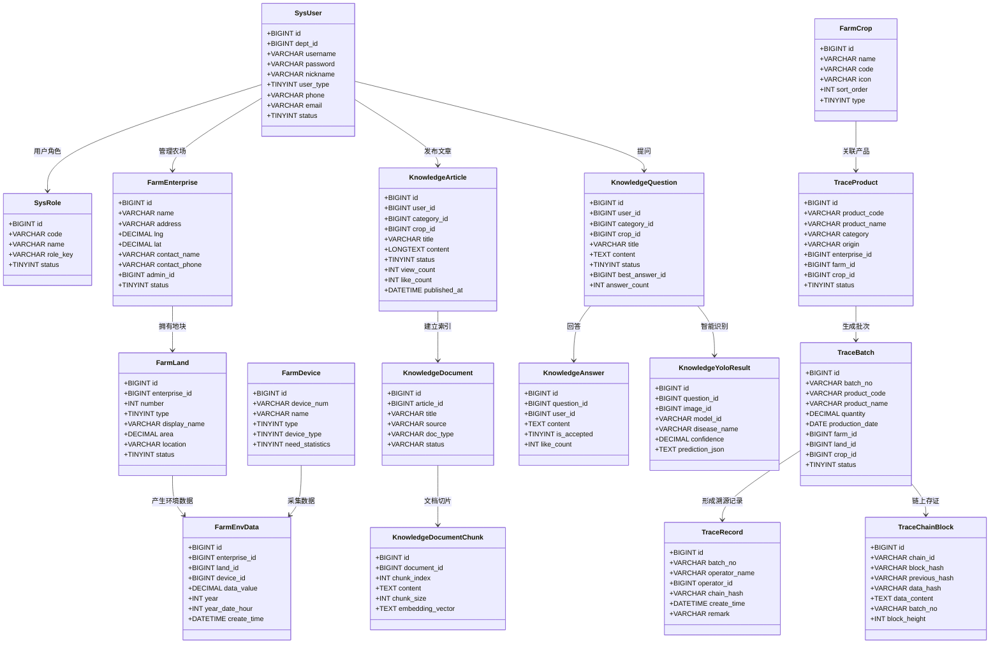
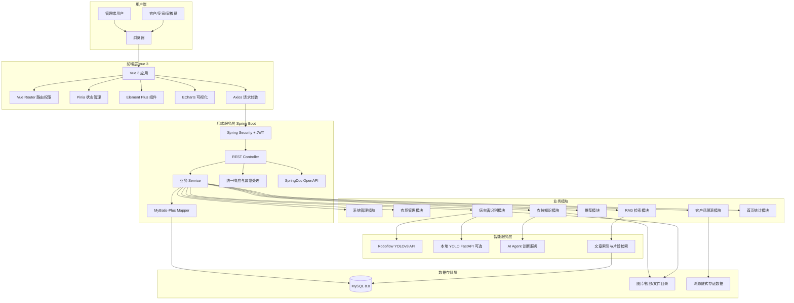

# 智慧农业综合服务平台图表

以下图表基于 `agriculture-platform` 主项目整理，适合放入小组总结报告、课程设计文档或答辩材料。

## 一、功能结构图

```mermaid
flowchart TD
    A[智慧农业综合服务平台]

    A --> B[系统管理]
    B --> B1[用户管理]
    B --> B2[角色管理]
    B --> B3[菜单权限]
    B --> B4[登录认证]
    B --> B5[操作日志]

    A --> C[农场管理]
    C --> C1[农场企业管理]
    C --> C2[地块管理]
    C --> C3[作物字典]
    C --> C4[设备管理]
    C --> C5[环境数据监测]
    C --> C6[天气预测]
    C --> C7[产量预测]

    A --> D[农产品溯源]
    D --> D1[产品管理]
    D --> D2[批次管理]
    D --> D3[生产记录]
    D --> D4[加工记录]
    D --> D5[质检记录]
    D --> D6[仓储记录]
    D --> D7[物流记录]
    D --> D8[销售记录]
    D --> D9[链上存证]
    D --> D10[全链路查询]

    A --> E[农技知识推广]
    E --> E1[农技文章]
    E --> E2[文章审核]
    E --> E3[问答社区]
    E --> E4[专家回答]
    E --> E5[农技讲座]
    E --> E6[农技视频]
    E --> E7[病虫害百科]
    E --> E8[知识图谱]

    A --> F[智能诊断]
    F --> F1[图片上传]
    F --> F2[YOLO 病虫害识别]
    F --> F3[AI Agent 诊断建议]
    F --> F4[自动回复]
    F --> F5[转专家审核]

    A --> G[RAG 知识检索]
    G --> G1[文章索引]
    G --> G2[文档切片]
    G --> G3[关键词检索]
    G --> G4[问答生成]
    G --> G5[引用来源返回]

    A --> H[个性化推荐]
    H --> H1[用户行为采集]
    H --> H2[用户画像]
    H --> H3[文章推荐]
    H --> H4[视频推荐]
    H --> H5[推荐日志]

    A --> I[首页看板]
    I --> I1[业务统计]
    I --> I2[趋势图表]
    I --> I3[平台概览]
```

## 二、实体属性图

```mermaid
classDiagram
    class SysUser {
        +BIGINT id
        +BIGINT dept_id
        +VARCHAR username
        +VARCHAR password
        +VARCHAR nickname
        +TINYINT user_type
        +VARCHAR phone
        +VARCHAR email
        +TINYINT status
    }

    class SysRole {
        +BIGINT id
        +VARCHAR code
        +VARCHAR name
        +VARCHAR role_key
        +TINYINT status
    }

    class FarmEnterprise {
        +BIGINT id
        +VARCHAR name
        +VARCHAR address
        +DECIMAL lng
        +DECIMAL lat
        +VARCHAR contact_name
        +VARCHAR contact_phone
        +BIGINT admin_id
        +TINYINT status
    }

    class FarmLand {
        +BIGINT id
        +BIGINT enterprise_id
        +INT number
        +TINYINT type
        +VARCHAR display_name
        +DECIMAL area
        +VARCHAR location
        +TINYINT status
    }

    class FarmCrop {
        +BIGINT id
        +VARCHAR name
        +VARCHAR code
        +VARCHAR icon
        +INT sort_order
        +TINYINT type
    }

    class FarmDevice {
        +BIGINT id
        +VARCHAR device_num
        +VARCHAR name
        +TINYINT type
        +TINYINT device_type
        +TINYINT need_statistics
    }

    class FarmEnvData {
        +BIGINT id
        +BIGINT enterprise_id
        +BIGINT land_id
        +BIGINT device_id
        +DECIMAL data_value
        +INT year
        +INT year_date_hour
        +DATETIME create_time
    }

    class TraceProduct {
        +BIGINT id
        +VARCHAR product_code
        +VARCHAR product_name
        +VARCHAR category
        +VARCHAR origin
        +BIGINT enterprise_id
        +BIGINT farm_id
        +BIGINT crop_id
        +TINYINT status
    }

    class TraceBatch {
        +BIGINT id
        +VARCHAR batch_no
        +VARCHAR product_code
        +VARCHAR product_name
        +DECIMAL quantity
        +DATE production_date
        +BIGINT farm_id
        +BIGINT land_id
        +BIGINT crop_id
        +TINYINT status
    }

    class TraceRecord {
        +BIGINT id
        +VARCHAR batch_no
        +VARCHAR operator_name
        +BIGINT operator_id
        +VARCHAR chain_hash
        +DATETIME create_time
        +VARCHAR remark
    }

    class TraceChainBlock {
        +BIGINT id
        +VARCHAR chain_id
        +VARCHAR block_hash
        +VARCHAR previous_hash
        +VARCHAR data_hash
        +TEXT data_content
        +VARCHAR batch_no
        +INT block_height
    }

    class KnowledgeArticle {
        +BIGINT id
        +BIGINT user_id
        +BIGINT category_id
        +BIGINT crop_id
        +VARCHAR title
        +LONGTEXT content
        +TINYINT status
        +INT view_count
        +INT like_count
        +DATETIME published_at
    }

    class KnowledgeQuestion {
        +BIGINT id
        +BIGINT user_id
        +BIGINT category_id
        +BIGINT crop_id
        +VARCHAR title
        +TEXT content
        +TINYINT status
        +BIGINT best_answer_id
        +INT answer_count
    }

    class KnowledgeAnswer {
        +BIGINT id
        +BIGINT question_id
        +BIGINT user_id
        +TEXT content
        +TINYINT is_accepted
        +INT like_count
    }

    class KnowledgeYoloResult {
        +BIGINT id
        +BIGINT question_id
        +BIGINT image_id
        +VARCHAR model_id
        +VARCHAR disease_name
        +DECIMAL confidence
        +TEXT prediction_json
    }

    class KnowledgeDocument {
        +BIGINT id
        +BIGINT article_id
        +VARCHAR title
        +VARCHAR source
        +VARCHAR doc_type
        +VARCHAR status
    }

    class KnowledgeDocumentChunk {
        +BIGINT id
        +BIGINT document_id
        +INT chunk_index
        +TEXT content
        +INT chunk_size
        +TEXT embedding_vector
    }

    SysUser --> SysRole : 用户角色
    SysUser --> FarmEnterprise : 管理农场
    FarmEnterprise --> FarmLand : 拥有地块
    FarmLand --> FarmEnvData : 产生环境数据
    FarmDevice --> FarmEnvData : 采集数据
    FarmCrop --> TraceProduct : 关联产品
    TraceProduct --> TraceBatch : 生成批次
    TraceBatch --> TraceRecord : 形成溯源记录
    TraceBatch --> TraceChainBlock : 链上存证
    SysUser --> KnowledgeArticle : 发布文章
    SysUser --> KnowledgeQuestion : 提问
    KnowledgeQuestion --> KnowledgeAnswer : 回答
    KnowledgeQuestion --> KnowledgeYoloResult : 智能识别
    KnowledgeArticle --> KnowledgeDocument : 建立索引
    KnowledgeDocument --> KnowledgeDocumentChunk : 文档切片
```

## 三、ER 图

```mermaid
erDiagram
    SYS_USER {
        BIGINT id PK
        BIGINT dept_id
        VARCHAR username
        VARCHAR password
        VARCHAR nickname
        TINYINT user_type
        VARCHAR phone
        TINYINT status
    }

    SYS_ROLE {
        BIGINT id PK
        VARCHAR code
        VARCHAR name
        VARCHAR role_key
        TINYINT status
    }

    SYS_USER_ROLE {
        BIGINT user_id FK
        BIGINT role_id FK
    }

    SYS_MENU {
        BIGINT menu_id PK
        VARCHAR menu_name
        BIGINT parent_id
        VARCHAR path
        VARCHAR perms
        CHAR menu_type
    }

    SYS_ROLE_MENU {
        BIGINT role_id FK
        BIGINT menu_id FK
    }

    FARM_ENTERPRISE {
        BIGINT id PK
        VARCHAR name
        VARCHAR address
        BIGINT admin_id FK
        TINYINT status
    }

    FARM_LAND {
        BIGINT id PK
        BIGINT enterprise_id FK
        INT number
        TINYINT type
        VARCHAR display_name
        DECIMAL area
    }

    FARM_CROP {
        BIGINT id PK
        VARCHAR name
        VARCHAR code
        TINYINT type
    }

    FARM_DEVICE {
        BIGINT id PK
        VARCHAR device_num
        VARCHAR name
        TINYINT device_type
    }

    FARM_ENV_DATA {
        BIGINT id PK
        BIGINT enterprise_id FK
        BIGINT land_id FK
        BIGINT device_id FK
        DECIMAL data_value
        DATETIME create_time
    }

    TRACE_PRODUCT {
        BIGINT id PK
        VARCHAR product_code UK
        VARCHAR product_name
        BIGINT enterprise_id FK
        BIGINT crop_id FK
        TINYINT status
    }

    TRACE_BATCH {
        BIGINT id PK
        VARCHAR batch_no UK
        VARCHAR product_code FK
        DECIMAL quantity
        BIGINT farm_id FK
        BIGINT land_id FK
        BIGINT crop_id FK
    }

    TRACE_PRODUCTION_RECORD {
        BIGINT id PK
        VARCHAR batch_no FK
        DATETIME sow_time
        DATETIME harvest_time
        VARCHAR chain_hash
    }

    TRACE_PROCESSING_RECORD {
        BIGINT id PK
        VARCHAR batch_no FK
        DATETIME processing_time
        VARCHAR quality_result
        VARCHAR chain_hash
    }

    TRACE_QUALITY_RECORD {
        BIGINT id PK
        VARCHAR batch_no FK
        DATETIME quality_date
        VARCHAR quality_result
        TINYINT qualified
        VARCHAR chain_hash
    }

    TRACE_STORAGE_RECORD {
        BIGINT id PK
        VARCHAR batch_no FK
        INT quantity
        VARCHAR change_type
        DATETIME change_time
        VARCHAR chain_hash
    }

    TRACE_LOGISTICS_RECORD {
        BIGINT id PK
        VARCHAR batch_no FK
        VARCHAR logistics_company
        DATETIME ship_time
        DATETIME arrival_time
        VARCHAR chain_hash
    }

    TRACE_SALES_RECORD {
        BIGINT id PK
        VARCHAR batch_no FK
        VARCHAR seller
        DECIMAL sales_price
        DATETIME listing_time
        VARCHAR chain_hash
    }

    TRACE_CHAIN_BLOCK {
        BIGINT id PK
        VARCHAR chain_id
        VARCHAR block_hash UK
        VARCHAR previous_hash
        VARCHAR data_hash
        VARCHAR batch_no FK
        INT block_height
    }

    KNOWLEDGE_CATEGORY {
        BIGINT id PK
        VARCHAR name
        BIGINT parent_id
    }

    KNOWLEDGE_ARTICLE {
        BIGINT id PK
        BIGINT user_id FK
        BIGINT category_id FK
        BIGINT crop_id FK
        VARCHAR title
        TINYINT status
    }

    KNOWLEDGE_QUESTION {
        BIGINT id PK
        BIGINT user_id FK
        BIGINT category_id FK
        BIGINT crop_id FK
        VARCHAR title
        TINYINT status
        BIGINT best_answer_id FK
    }

    KNOWLEDGE_ANSWER {
        BIGINT id PK
        BIGINT question_id FK
        BIGINT user_id FK
        TEXT content
        TINYINT is_accepted
    }

    KNOWLEDGE_YOLO_RESULT {
        BIGINT id PK
        BIGINT question_id FK
        BIGINT image_id
        VARCHAR model_id
        VARCHAR disease_name
        DECIMAL confidence
    }

    KNOWLEDGE_LECTURE {
        BIGINT id PK
        BIGINT user_id FK
        VARCHAR title
        DATETIME lecture_time
        INT max_participants
        TINYINT status
    }

    KNOWLEDGE_VIDEO {
        BIGINT id PK
        VARCHAR title
        BIGINT category_id FK
        VARCHAR video_url
        BIGINT create_user_id FK
        INT view_count
    }

    KNOWLEDGE_DOCUMENT {
        BIGINT id PK
        BIGINT article_id FK
        VARCHAR title
        VARCHAR doc_type
        VARCHAR status
    }

    KNOWLEDGE_DOCUMENT_CHUNK {
        BIGINT id PK
        BIGINT document_id FK
        INT chunk_index
        TEXT content
        TEXT embedding_vector
    }

    KNOWLEDGE_USER_BEHAVIOR {
        BIGINT id PK
        BIGINT user_id FK
        BIGINT article_id FK
        BIGINT video_id FK
        VARCHAR behavior_type
        DOUBLE weight
    }

    KNOWLEDGE_RECOMMEND_LOG {
        BIGINT id PK
        BIGINT user_id FK
        BIGINT article_id FK
        DOUBLE score
        VARCHAR strategy
    }

    SYS_USER ||--o{ SYS_USER_ROLE : has
    SYS_ROLE ||--o{ SYS_USER_ROLE : assigned
    SYS_ROLE ||--o{ SYS_ROLE_MENU : owns
    SYS_MENU ||--o{ SYS_ROLE_MENU : authorized

    SYS_USER ||--o{ FARM_ENTERPRISE : manages
    FARM_ENTERPRISE ||--o{ FARM_LAND : owns
    FARM_ENTERPRISE ||--o{ FARM_ENV_DATA : collects
    FARM_LAND ||--o{ FARM_ENV_DATA : has
    FARM_DEVICE ||--o{ FARM_ENV_DATA : reports

    FARM_ENTERPRISE ||--o{ TRACE_PRODUCT : produces
    FARM_CROP ||--o{ TRACE_PRODUCT : crop
    TRACE_PRODUCT ||--o{ TRACE_BATCH : batches
    FARM_LAND ||--o{ TRACE_BATCH : source_land
    FARM_CROP ||--o{ TRACE_BATCH : crop

    TRACE_BATCH ||--o{ TRACE_PRODUCTION_RECORD : production
    TRACE_BATCH ||--o{ TRACE_PROCESSING_RECORD : processing
    TRACE_BATCH ||--o{ TRACE_QUALITY_RECORD : quality
    TRACE_BATCH ||--o{ TRACE_STORAGE_RECORD : storage
    TRACE_BATCH ||--o{ TRACE_LOGISTICS_RECORD : logistics
    TRACE_BATCH ||--o{ TRACE_SALES_RECORD : sales
    TRACE_BATCH ||--o{ TRACE_CHAIN_BLOCK : evidence

    SYS_USER ||--o{ KNOWLEDGE_ARTICLE : writes
    KNOWLEDGE_CATEGORY ||--o{ KNOWLEDGE_ARTICLE : classifies
    FARM_CROP ||--o{ KNOWLEDGE_ARTICLE : relates
    SYS_USER ||--o{ KNOWLEDGE_QUESTION : asks
    KNOWLEDGE_CATEGORY ||--o{ KNOWLEDGE_QUESTION : classifies
    FARM_CROP ||--o{ KNOWLEDGE_QUESTION : relates
    KNOWLEDGE_QUESTION ||--o{ KNOWLEDGE_ANSWER : contains
    SYS_USER ||--o{ KNOWLEDGE_ANSWER : answers
    KNOWLEDGE_QUESTION ||--o{ KNOWLEDGE_YOLO_RESULT : detects

    SYS_USER ||--o{ KNOWLEDGE_LECTURE : publishes
    SYS_USER ||--o{ KNOWLEDGE_VIDEO : uploads
    KNOWLEDGE_CATEGORY ||--o{ KNOWLEDGE_VIDEO : classifies

    KNOWLEDGE_ARTICLE ||--o| KNOWLEDGE_DOCUMENT : indexed_as
    KNOWLEDGE_DOCUMENT ||--o{ KNOWLEDGE_DOCUMENT_CHUNK : split_into

    SYS_USER ||--o{ KNOWLEDGE_USER_BEHAVIOR : generates
    KNOWLEDGE_ARTICLE ||--o{ KNOWLEDGE_USER_BEHAVIOR : article_target
    KNOWLEDGE_VIDEO ||--o{ KNOWLEDGE_USER_BEHAVIOR : video_target
    SYS_USER ||--o{ KNOWLEDGE_RECOMMEND_LOG : receives
    KNOWLEDGE_ARTICLE ||--o{ KNOWLEDGE_RECOMMEND_LOG : recommended
```

## 四、技术架构图

```mermaid
flowchart TB
    subgraph Client[用户端]
        Browser[浏览器]
        Admin[管理端用户]
        Farmer[农户/专家/审核员]
    end

    subgraph Frontend[前端层 Vue 3]
        Vue[Vue 3 应用]
        Router[Vue Router 路由权限]
        Pinia[Pinia 状态管理]
        Element[Element Plus 组件]
        ECharts[ECharts 可视化]
        Axios[Axios 请求封装]
    end

    subgraph Backend[后端服务层 Spring Boot]
        Security[Spring Security + JWT]
        Controller[REST Controller]
        Service[业务 Service]
        Mapper[MyBatis-Plus Mapper]
        Exception[统一响应与异常处理]
        OpenAPI[SpringDoc OpenAPI]
    end

    subgraph Business[业务模块]
        System[系统管理模块]
        Farm[农场管理模块]
        Trace[农产品溯源模块]
        Knowledge[农技知识模块]
        Recommend[推荐模块]
        YoloModule[病虫害识别模块]
        RagModule[RAG 检索模块]
        Dashboard[首页统计模块]
    end

    subgraph AI[智能服务层]
        Roboflow[Roboflow YOLOv8 API]
        LocalYolo[本地 YOLO FastAPI 可选]
        Agent[AI Agent 诊断服务]
        RagSearch[文章索引与片段检索]
    end

    subgraph Data[数据存储层]
        MySQL[(MySQL 8.0)]
        FileStore[图片/视频/文件目录]
        ChainData[溯源链式存证数据]
    end

    Browser --> Vue
    Admin --> Browser
    Farmer --> Browser

    Vue --> Router
    Vue --> Pinia
    Vue --> Element
    Vue --> ECharts
    Vue --> Axios

    Axios --> Security
    Security --> Controller
    Controller --> Service
    Service --> Mapper
    Controller --> Exception
    Controller --> OpenAPI

    Service --> System
    Service --> Farm
    Service --> Trace
    Service --> Knowledge
    Service --> Recommend
    Service --> YoloModule
    Service --> RagModule
    Service --> Dashboard

    Mapper --> MySQL
    Trace --> ChainData
    Knowledge --> FileStore
    YoloModule --> FileStore
    YoloModule --> Roboflow
    YoloModule --> LocalYolo
    Knowledge --> Agent
    RagModule --> RagSearch
    RagSearch --> MySQL
```
